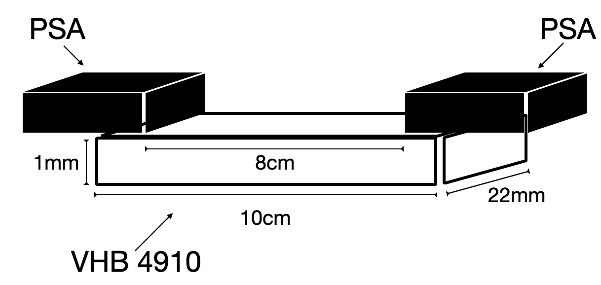

# Experimental Data on VHB4910

---

## Introduction
This repository contains experimental data on VHB4910, a viscoelastic material. The data includes results from various uniaxial loading-unloading tests performed at different displacement rates and stretch ratios. This data is valuable for understanding the material's deformation behavior and for validating computational models.

## Uniaxial Loading-Unloading Tests
- **Maximum Displacements**: $\Delta_{\text{max}} = \{4,\,8,\,12,\,16\}\, \text{cm}$
  - **Nominal Stretch Ratios**: $\lambda = \{1.5,\,2.0,\,2.5,\,3.0\}$
    - *Note*: For $L_0 = 8\, \text{cm}$, $\lambda = 1 + \Delta/L_0$.
    - *Anomaly Resolved*: Updated stretch ratios align with $\Delta/L_0$.

- **Strain Rate Modulation**:
  - **Displacement Rates**: $\dot{\Delta} = \{0.08,\,0.24,\,0.4\}\, \text{cm/s}$
  - **Normalized Strain Rates**: $\dot{\lambda} = \dot{\Delta}/L_0 = \{0.01,\,0.03,\,0.05\}\, \text{s}^{-1}$
    - *Validation*: Confirms undeformed length $L_0 = 8\, \text{cm}$.

---
